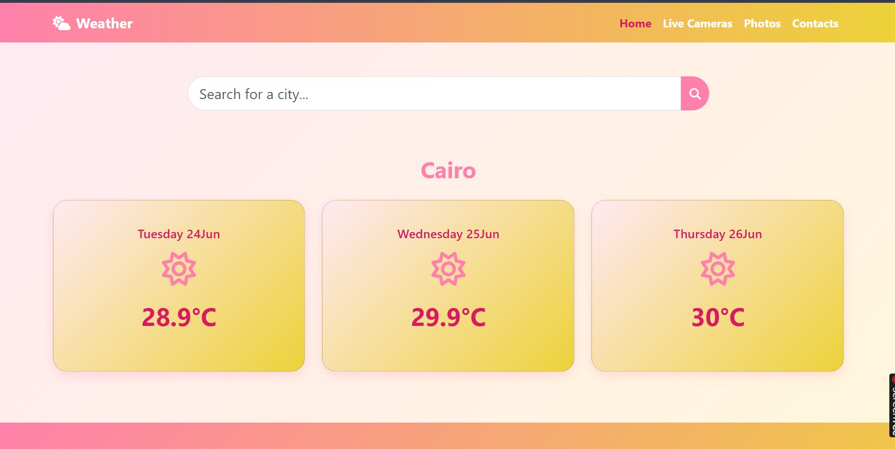

# 🌦️ Weather App

A responsive weather web app that allows users to check the weather of any city in real time. Built using HTML, CSS, JavaScript, and Bootstrap.

## 🌐 Live Demo
[Click here to try it out!](https://amiraram23.github.io/Weather-App/)

## 🔧 Features
- Get current weather info for any city
- Responsive design for mobile and desktop
- Girly UI with pink and baby yellow colors 🌸

## 🛠️ Tech Stack
- HTML5
- CSS3
- JavaScript (ES6+)
- Bootstrap 5
- WeatherAPI

## 📁 Folder Structure
Weather-App
├── index.html
├── style.css
├── script.js
└── snap-of-App.jpg

## 🙋‍♀️ Author
**Amira Ramadan**  
[LinkedIn](https://linkedin.com/in/amira-ramadan-gisdeveloper) | [Portfolio](https://sites.google.com/view/amira-portfolio/home)
